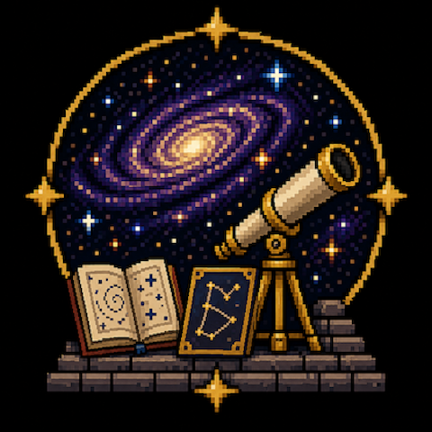

# AstraExtera



AstraExtera gives each Vintage Story save a generated astronomical setting. The server authors a
galaxy, a location inside it, a visible star field, and a local planetary system, then sends the
stored result to every client. [AstraTerra](https://github.com/lalmei/astraterra) supplies the sky
renderer and the observing tools.

The generated radius, gravity, temperature, and orbital facts describe the world in AstraExtera's
galaxy panel. They do not change Vintage Story terrain, climate, gravity, calendar, seasons, day
length, or world generation.

## Install and start observing

1. Install Vintage Story 1.22.2 or newer.
2. Install AstraTerra 0.10.0 or newer, then install AstraExtera. Enable both mods.
3. Join a world and press **Ctrl+Shift+S** to inspect its galaxy and local system. The key is
   remappable as **Galaxy panel**.
4. Open the handbook with **H**, select **Astronomy**, and begin with a Sky Disc or telescope.

AstraTerra owns the instruments. Through it you can mark sunrise and sunset on a Sky Disc, measure a
light with a Sextant, draw constellations into a book through a telescope, and use a calibrated
Astrolabe to plan another observation. AstraExtera changes which stars, planets, comets, showers,
and nearby moons those tools encounter.

Read the [player guide](docs/player-guide.md) for the controls, configuration, coordinate terms, and
current limitations. The in-game handbook keeps the same instructions close to the relevant items.

## What changes in the sky

- Fixed stars are sampled from the generated galaxy's stellar density and dust extinction. The
  brightest 10,000 fit in the catalog; the remainder contributes to an unresolved galactic glow.
- The celestial pole is generated for the save, so the glow and stars can wheel at a different
  angle than Earth's sky.
- Companion planets use generated, simplified Keplerian elements. Comets use generated apparition
  tracks, and meteor showers are scheduled from those authored comets.
- A planet world has zero to three generated moons. On a moon world, the parent giant stays fixed in
  the sky and sibling moons move around it.
- Earth guide groups, sky cultures, and deep-sky objects are removed from the client catalog. Players
  can draw their own constellations, but AstraExtera does not generate nebulae, clusters, or galaxies
  for telescope plates.

Vintage Story still controls the sun, daylight, calendar, terrain, climate, and moonlight. The
ordinary moon disc is hidden, but its calendar phase and illumination remain part of the game
simulation. AstraTerra's own Earth Milky Way is a separate renderer; see the
[configuration notes](docs/player-guide.md#configuration) if both galactic bands appear.

## Server commands

- `/astraextera galaxy` reports the current cosmology and local system. It requires the normal chat
  privilege.
- `/astraextera reroll` generates a new random cosmology.
- `/astraextera reroll <seed>` uses a signed 64-bit seed. In the server console, omit the leading
  slash. Rerolling requires `controlserver`.

A reroll replaces the saved galaxy placement, star field, and local sky, then broadcasts them. It
does not change the terrain seed. Existing constellation lines and star names remain stored, but
their numeric star IDs now select stars in the new catalog, so old drawings change shape.

## Developer documentation

The [developer guide](docs/developer-guide.md) covers:

- server authoring, persistence, and client handoff;
- galaxy, star-field, local-system, coordinate, and rendering models;
- save formats, caches, and asset loading;
- the AstraTerra catalog-replacement seam;
- supported extension points and current compatibility gaps;
- subsystem entry points and verification commands.

AstraExtera does not currently expose a supported public API of its own. Mods that provide or replace
celestial catalogs should use AstraTerra's catalog replacement API and treat AstraExtera's public C#
types as implementation details.

## Build and verify

The repository pins .NET SDK 10.0.100. On macOS the build defaults to
`/Applications/Vintage Story.app` and a sibling `../astra_terra` checkout. Set `VINTAGE_STORY` and
`ASTRA_TERRA` to override those reference locations.

```bash
make test
make build
make package
```

Useful authoring tools:

```bash
make galaxy-preview SEED=42
make star-catalog SEED=42
make celestial-textures
make moddb-preview
```

`make deploy` and `make deploy-run` use the macOS Vintage Story data paths unless `GAME_APP` and
`MODS_DIR` are overridden. The generated texture assets are committed; the game does not run the
texture preparation script.

Automated tests cover generation, serialization, export, geometry, rendering inputs, commands, and
asset contracts. They do not establish that the sky looks correct in a running game or that another
mod has not replaced the same AstraTerra catalogs later in startup.

Copyright 2026 Leandro G. Almeida. Licensed under the
[GNU Affero General Public License, version 3 only](LICENSE) (`AGPL-3.0-only`).
